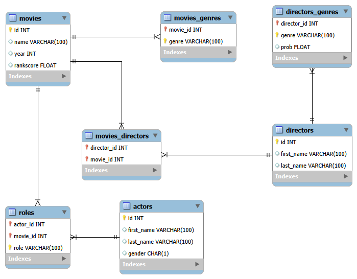

# IMDB SQL Analysis Project

A structured SQL project built on the IMDB relational database, covering 35 analytical queries ranging from basic data retrieval to advanced techniques like Window Functions, CTEs and correlated subqueries.

## Project Overview

| Detail | Info |
|---|---|
| **Database** | MySQL |
| **Dataset** | IMDB (Movies, Actors, Directors, Genres, Roles) |
| **Total Queries** | 35 |
| **Difficulty Range** | Beginner → Advanced |

## Database Schema

The project uses the following tables:

| Table | Description |
|---|---|
| `movies` | Movie ID, name, year, rankscore |
| `actors` | Actor ID, first name, last name, gender |
| `directors` | Director ID, first name, last name |
| `roles` | Maps actors to movies with role name |
| `directors_genres` | Maps directors to genres |
| `movies_genres` | Maps movies to genres |

## ER Diagram



## Files

```
📁 IMDB-SQL-Project/
├── schema.sql
├── IMDB movie analysis using SQL.sql
├── ER_Diagram.png
└── README.md
```

## Tools Used

- **MySQL 8.0**
- **MySQL Workbench** (query editor + ER diagram)

##  Author

**Varun Angaria**
Data Analyst
[LinkedIn](https://www.linkedin.com/in/varun-angaria1998/) • [GitHub](https://github.com/varunangaria)
